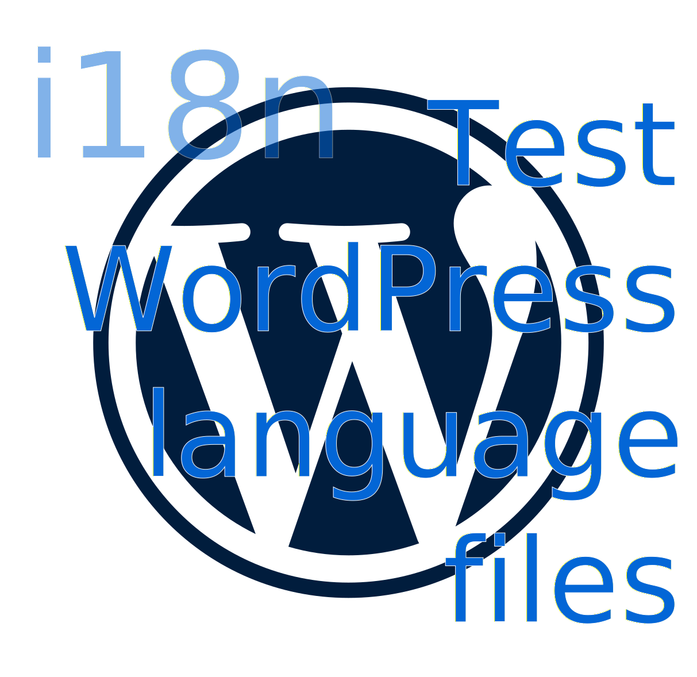

<!-- How to generate this file
```shell
npx --yes github-action-readme-generator@v1.7.2
```
-->
<div align="center" width="100%">
<!-- start title -->

# " /> GitHub Action: Test WordPress language files

<!-- end title -->
<!-- start badges -->

<a href="https://github.com/holyhope/test-wordpress-languages-github-action/releases/latest"></a><a href="https://github.com/holyhope/test-wordpress-languages-github-action/releases/latest"></a><a href="https://github.com/holyhope/test-wordpress-languages-github-action/issues"></a>

<!-- end badges -->
</div>

<!-- start description -->

Check internationalization files for WordPress plugins for being up-to-date.

<!-- end description -->

<!-- start contents -->

This action checks the [i18n files for the WordPress plugin or theme](https://codex.wordpress.org/I18n_for_WordPress_Developers) by running [`wp i18n make-pot`](https://developer.wordpress.org/cli/commands/i18n/make-pot/) and [`wp i18n update-po`](https://developer.wordpress.org/cli/commands/i18n/update-po/). This helps to ensure that the internationalization files are up-to-date and that the translations are not missing.

By default the action fails if the POT or PO files are not up-to-date or if there are warnings on compilation.
This can be disabled with [the `fail_on_diff` and `fail_on_warning` inputs](#inputs).

The action outputs a patch file with the changes to apply to the files, and a file containing all compiler warnings.

<!-- end contents -->

## Usage

<!-- start usage -->

```yaml
- uses: holyhope/test-wordpress-languages-github-action@main
  with:
    # Description: Plugin or theme slug.
    #
    slug: ""

    # Description: Directory to scan for string extraction.
    #
    # Default: .
    source: ""

    # Description: Path to an existing POT file to use for updating.
    #
    # Default: `{source}/{slug}.pot`
    #
    pot_file: ""

    # Description: PO files to update or a directory containing multiple PO files.
    #
    # Type: multi-line string
    #
    # Default: all PO files in the source directory with the same prefix as the POT
    # file.
    #
    po_path: ""

    # Description: Path to the languages directory
    #
    # Default: languages
    languages_directory: ""

    # Description: Pattern to ignore when checking the POT file changes.
    #
    # Type: multi-line string
    #
    # Default: "POT-Creation-Date:
    ignored_patterns: ""

    # Description: Text domain to look for in the source code, unless the
    # `ignore-domain` option is `true`.
    #
    # Default: the "Text Domain" header of the plugin or theme is used.
    #
    domain: ""

    # Description: Ignore the text domain completely and extract strings with any text
    # domain.
    #
    # Default: false
    ignore_domain: ""

    # Description: Skips JavaScript string extraction. Useful when this is done in
    # another build step, e.g. through Babel.
    #
    # Default: false
    skip_js: ""

    # Description: Skips PHP string extraction.
    #
    # Default: false
    skip_php: ""

    # Description: Skips Blade-PHP string extraction.
    #
    # Default: false
    skip_blade: ""

    # Description: Skips string extraction from block.json files.
    #
    # Default: false
    skip_block_json: ""

    # Description: Skips string extraction from theme.json files.
    #
    # Default: false
    skip_theme_json: ""

    # Description: Skips string audit where it tries to find possible mistakes in
    # translatable strings.
    #
    # Default: true
    skip_audit: ""

    # Description: List of files and paths that should be skipped for string
    # extraction.
    #
    # Simple glob patterns can be used, i.e. `foo-*.php` excludes any PHP file with
    # the `foo-` prefix. Leading and trailing slashes are ignored, i.e.
    # `/my/directory/` is the same as `my/directory`. The following files and folders
    # are always excluded: node_modules, .git, .svn, .CVS, .hg, vendor, \*.min.js.
    #
    # Type: multi-line string Default: None
    #
    exclude: ""

    # Description: List of files and paths that should be used for string extraction.
    # If provided, only these files and folders will be taken into account for string
    # extraction. Simple glob patterns can be used, i.e. `foo-*.php` includes any PHP
    # file with the `foo-` prefix. Leading and trailing slashes are ignored, i.e.
    # `/my/directory/` is the same as `my/directory`. Type: multi-line string Default:
    # None
    #
    include: ""

    # Description: Whether to write `#: filename:line` lines. Note that disabling this
    # option makes it harder for technically skilled translators to understand each
    # message’s context.
    #
    # Default: true
    location: ""

    # Description: Array in JSON format of custom headers which will be added to the
    # POT file.
    #
    headers: ""

    # Description: String that should be added as a comment to the top of the
    # resulting POT file.
    #
    file_comment: ""

    # Description: Name to use for package name in the resulting POT file's
    # `Project-Id-Version` header. Overrides plugin or theme name, if applicable.
    #
    package_name: ""

    # Description: Whether to fail the build if there are differences in the POT file.
    #
    # Default: true
    fail_on_diff: ""

    # Description: Whether to fail the build if there are warnings.
    #
    # Default: true
    fail_on_warning: ""

    # Description: Path to the WP-CLI binary. To use a custom version of WP-CLI, see
    # the
    # [`install-wp-cli` GitHub action](https://github.com/marketplace/actions/install-wp-cli)
    # Default: Downloaded from the official WP-CLI website.
    #
    wp_cli_path: ""
```

<!-- end usage -->

## Inputs

<!-- start inputs -->

| **<b>Input</b>**                        | **<b>Description</b>**                                                                                                                                                                                                                                                                                                                                                                                              | **<b>Default</b>**                | **<b>Required</b>** |
| --------------------------------------- | ------------------------------------------------------------------------------------------------------------------------------------------------------------------------------------------------------------------------------------------------------------------------------------------------------------------------------------------------------------------------------------------------------------------- | --------------------------------- | ------------------- |
| <b><code>slug</code></b>                | Plugin or theme slug.                                                                                                                                                                                                                                                                                                                                                                                               |                                   | **true**            |
| <b><code>source</code></b>              | Directory to scan for string extraction.                                                                                                                                                                                                                                                                                                                                                                            | <code>.</code>                    | **false**           |
| <b><code>pot_file</code></b>            | Path to an existing POT file to use for updating.                                                                                                                                                                                                                                                                                                                                                                   |                                   | **false**           |
| <b><code>po_path</code></b>             | PO files to update or a directory containing multiple PO files.                                                                                                                                                                                                                                                                                                                                                     |                                   | **false**           |
| <b><code>languages_directory</code></b> | Path to the languages directory                                                                                                                                                                                                                                                                                                                                                                                     | <code>languages</code>            | **false**           |
| <b><code>ignored_patterns</code></b>    | Pattern to ignore when checking the POT file changes.                                                                                                                                                                                                                                                                                                                                                               | <code>"POT-Creation-Date: </code> | **false**           |
| <b><code>domain</code></b>              | unless the `ignore-domain` option is `true`.                                                                                                                                                                                                                                                                                                                                                                        |                                   | **false**           |
| <b><code>ignore_domain</code></b>       | Ignore the text domain completely and<br />extract strings with any text domain.                                                                                                                                                                                                                                                                                                                                    |                                   | **false**           |
| <b><code>skip_js</code></b>             | Skips JavaScript string extraction.<br />Useful when this is done in another build step, e.g. through Babel.                                                                                                                                                                                                                                                                                                        |                                   | **false**           |
| <b><code>skip_php</code></b>            | Skips PHP string extraction.                                                                                                                                                                                                                                                                                                                                                                                        |                                   | **false**           |
| <b><code>skip_blade</code></b>          | Skips Blade-PHP string extraction.                                                                                                                                                                                                                                                                                                                                                                                  |                                   | **false**           |
| <b><code>skip_block_json</code></b>     | Skips string extraction from block.json files.                                                                                                                                                                                                                                                                                                                                                                      |                                   | **false**           |
| <b><code>skip_theme_json</code></b>     | Skips string extraction from theme.json files.                                                                                                                                                                                                                                                                                                                                                                      |                                   | **false**           |
| <b><code>skip_audit</code></b>          | Skips string audit where it tries<br />to find possible mistakes in translatable strings.                                                                                                                                                                                                                                                                                                                           | <code>true</code>                 | **false**           |
| <b><code>exclude</code></b>             | List of files and paths that should be skipped for string extraction.                                                                                                                                                                                                                                                                                                                                               |                                   | **false**           |
| <b><code>include</code></b>             | List of files and paths that should be used for string extraction.<br />If provided, only these files and folders will be taken into account for string extraction.<br />Simple glob patterns can be used, i.e. `foo-*.php` includes any PHP file with the `foo-` prefix. Leading and trailing slashes are ignored, i.e. `/my/directory/` is the same as `my/directory`.<br />Type: multi-line string Default: None |                                   | **false**           |
| <b><code>location</code></b>            | Whether to write `#: filename:line` lines.<br />Note that disabling this option makes it harder for technically skilled translators to understand each message’s context.                                                                                                                                                                                                                                           | <code>true</code>                 | **false**           |
| <b><code>headers</code></b>             | Array in JSON format of custom headers which will be added to the POT file.                                                                                                                                                                                                                                                                                                                                         |                                   | **false**           |
| <b><code>file_comment</code></b>        | String that should be added as a comment to the top of the resulting POT file.                                                                                                                                                                                                                                                                                                                                      |                                   | **false**           |
| <b><code>package_name</code></b>        | Name to use for package name in the resulting POT file's `Project-Id-Version` header.<br />Overrides plugin or theme name, if applicable.                                                                                                                                                                                                                                                                           |                                   | **false**           |
| <b><code>fail_on_diff</code></b>        | Whether to fail the build if there are differences in the POT file.                                                                                                                                                                                                                                                                                                                                                 | <code>true</code>                 | **false**           |
| <b><code>fail_on_warning</code></b>     | Whether to fail the build if there are warnings.                                                                                                                                                                                                                                                                                                                                                                    | <code>true</code>                 | **false**           |
| <b><code>wp_cli_path</code></b>         | Path to the WP-CLI binary.<br />To use a custom version of WP-CLI, see the [`install-wp-cli` GitHub action](https://github.com/marketplace/actions/install-wp-cli)<br />Default: Downloaded from the official WP-CLI website.                                                                                                                                                                                       |                                   | **false**           |

<!-- end inputs -->
<!-- start outputs -->

| **<b>Output</b>**                 | **<b>Description</b>**                                  |
| --------------------------------- | ------------------------------------------------------- |
| <b><code>patch_path</code></b>    | Path to the patch file containing the changes to apply. |
| <b><code>warnings_path</code></b> | Path to the file containing warnings.                   |

<!-- end outputs -->
